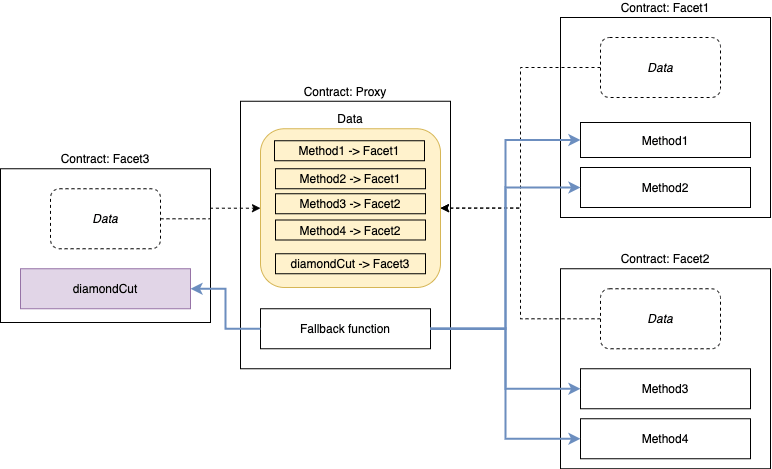

import Callout from 'nextra-theme-docs/callout'


# **The Diamond (Multi-Facet Proxy)**
<iframe src="https://diamondtool.vercel.app/" width="100%" height="432"></iframe>


## **Diamond**

The Diamond is the proxy, when an external function is called and executed the following occurs:

    1. Fallback function on Diamond determines which facet to call based on first 4 bytes of call data (*function selector*)
    2. Function is executed from the facet using `delegatecall`
    3. Diamond’s fallback function and `delegatecall`enable a diamond to execute a facet’s function as if it was implemented by the diamond itself.


<Callout emoji="📌">
  `msg.sender` and `msg.value` values do not change, only the diamond’s storage is read/written to.
</Callout>

<br/>



#### **Fallback Function Implementation**    
    ```js
    //Find facet for function that is called and execute the
    // function if a facet is found and return any value.
    fallback()externalpayable {
    // get facet from function selector
    address facet= selectorTofacet[msg.sig];
      require(facet!=address(0));
    // Execute external function from facet using delegatecall and return any value.
    assembly {
    // copy function selector and any arguments
        calldatacopy(0, 0, calldatasize())
    // execute function call using the facet
    let result:= delegatecall(gas(), facet, 0, calldatasize(), 0, 0)
    // get any return value
        returndatacopy(0, 0, returndatasize())
    // return any return value or error back to the caller
    switch result
    case 0 {revert(0, returndatasize())}
    default {return (0, returndatasize())}
      }
    }
    ```
    The fallback function finds the facet with the function being called and executes if a facet is found.


## **Facets**

<aside>
> The term facet comes from the diamond industry. It is a side, or flat surface of a diamond.
</aside>

A **facet** is a stateless smart contract or Solidity library with external functions. 
A facet is deployed and one or more of its functions are added to one or more diamonds. 
A facet does not store data within its own contract storage but it can define state and read and write to the storage of one or more diamonds. 
Facets of a diamond share the same storage address space because they have the same diamond. 

The facets of a diamond can be organized like a file system:

1. Similar and related functions can be put in the same facet.
2. Similar and related facets can be put in the same folder.
3. Similar and related folders can be put in the same parent folder.

All facet external functions are called with `delegatecall` from a diamond. 
A diamond is deployed by adding at least a facet to add the ‘diamondCut’ or other upgrade function in the constructor of the diamond. 
Once deployed more facets can be added using the upgrade function. 

## **Diamond Cut**

<aside>
> A `DiamondCut` event must be emitted any time external functions are added, replaced, or removed.
</aside>

The `diamondCut` function updates any number of functions from any number of facets in a single transaction preventing data corruption which could occur in upgrades over multiple transactions. A diamond contains a mapping of function selectors to facet addresses, functions are added/replaced/removed by modifying this mapping. 

```js
interface IDiamond {
    enum FacetCutAction {Add, Replace, Remove}
    // Add=0, Replace=1, Remove=2

    struct FacetCut {
        address facetAddress;
        FacetCutAction action;
        bytes4[] functionSelectors;
    }

    event DiamondCut(FacetCut[] _diamondCut, address _init, bytes _calldata);
}
```

<Callout>
`diamondCut` is specified for the purpose of interoperability. Diamond tools, software and user-interfaces should expect and use the standard `diamondCut` function.
</Callout>

Diamonds should implement the IDiamondCut interface if after their deployment they allow modifications to their function selector mapping.

```js
interface IDiamondCut is IDiamond {
    /// @notice Add/replace/remove any number of functions and optionally execute
    ///         a function with delegatecall
    /// @param _diamondCut Contains the facet addresses and function selectors
    /// @param _init The address of the contract or facet to execute _calldata
    /// @param _calldata A function call, including function selector and arguments
    ///                  _calldata is executed with delegatecall on _init
    function diamondCut(
        FacetCut[] calldata _diamondCut,
        address _init,
        bytes calldata _calldata
    ) external;
}
```

- `DiamondCut`event records all functions that are added, replaced or removed on a diamond providing a historical record of all upgrades on a diamond.
- `diamondCut` function is used to add/replace/remove any number of facets and functions to a diamond in a single transaction. Executing an upgrade in a single transaction is important to prevent the Diamond from an inconsistent state at any time.
- The `diamondCut` function has the ability to execute an external function with `delegatecall` during an upgrade. This is to initialize state variables and otherwise make any changes needed for an upgrade.

## **Diamond Loupe**

> A loupe is a special magnifying glass for looking at and inspecting diamonds.

The verified source code of a diamond does not include what functions it has so a different mechanism is needed. 
A diamond has four standard functions called the **loupe functions** that are used to show what functions exist on diamond. 
The loupe functions can be used in user-interface software or deployment functionality, upgrade functionality, testing and other software.

```js
// A loupe is a small magnifying glass used to look at diamonds.
// These functions look at diamonds
interface IDiamondLoupe {
    struct Facet {
        address facetAddress;
        bytes4[] functionSelectors;
    }

    /// @notice Gets all facet addresses and their four byte function selectors.
    /// @return facets_ Facet
    function facets() external view returns (Facet[] memory facets_);

    /// @notice Gets all the function selectors supported by a specific facet.
    /// @param _facet The facet address.
    /// @return facetFunctionSelectors_
    function facetFunctionSelectors(address _facet) external view returns (bytes4[] memory facetFunctionSelectors_);

    /// @notice Get all the facet addresses used by a diamond.
    /// @return facetAddresses_
    function facetAddresses() external view returns (address[] memory facetAddresses_);

    /// @notice Gets the facet that supports the given selector.
    /// @dev If facet is not found return address(0).
    /// @param _functionSelector The function selector.
    /// @return facetAddress_ The facet address.
    function facetAddress(bytes4 _functionSelector) external view returns (address facetAddress_);
}
```

The loupe functions can be used for many things including:
1. To show all functions used by a diamond.
2. To query services(Etherscan) or files to retrieve and show all source code used by a diamond.
3. To query services like Etherscan or files to retrieve ABI information for a diamond.
4. To test/verify that a transaction that adds/replaces/removes functions on a diamond.
5. To find out what functions a diamond has before calling functions on it.
6. To be used by tools and programming libraries to deploy and upgrade diamonds.
7. To be used by user interfaces to show information about diamonds.
8. To be used by user interfaces to enable users to call functions on diamonds.

<Callout>
[louper.dev](https://louper.dev/) is a website that displays info on diamonds and executing their functions.
</Callout>