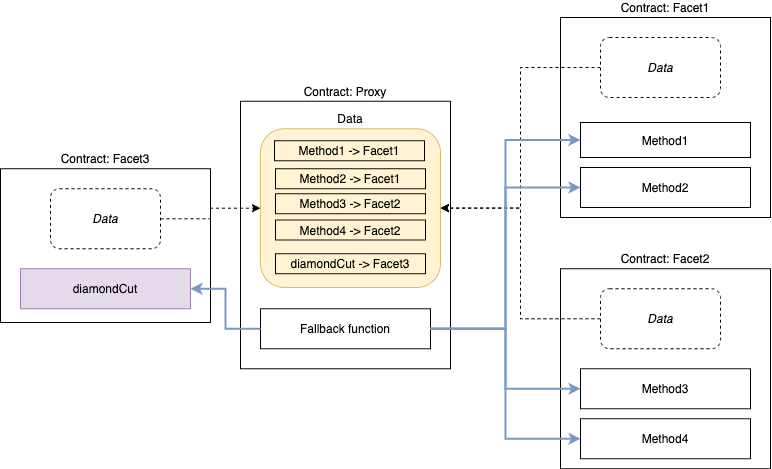

import Callout from 'nextra-theme-docs/callout'

# **Proxy Types**
 

## **Proxy Overview**
In simplest form, a proxy contract is a contract which delegates calls to another contract. 
Users go through the proxy, and the proxy knows which contract to delegate the call to (the target).
A proxy pattern introduces upgradability for contracts by allowing users to change the target address inside the proxy contract.

 

 

- Proxy contract is what the user interacts with and holds the data
- Proxies are immutable but contain a [fallback function](https://docs.soliditylang.org/en/v0.8.9/contracts.html#fallback-function)
- The fallback function catches function calls and uses `delegatecall` to forward to logic contract
- `delegatecall` allows the proxy contract to use functions on the logic contract
- Logic contract stores functions, defined separate from data

 

## **Transparent Proxy**

Instead of interacting with your smart contract directly, 
users interact with a proxy that holds the state and delegates execution to a logic contract for functionality.
Transparent proxies are implemented using [ERC1967Proxy](https://docs.openzeppelin.com/contracts/4.x/api/proxy#ERC1967Proxy).

***Transparent proxies include the upgrade and admin logic in the proxy itself.***

 

 

<Callout emoji="💎">
Upgradeability is achieved by changing the reference to the logic contract in the proxy contract, so new functionality is used for executing all calls.
</Callout>

#### Summary
- Upgrade is handled by proxy contract.
- Deployment is more expensive.
- It makes things easy to maintain.

## **UUPS Proxy**
#### [**EIP-1822: Universal Upgradeable Proxy Standard (UUPS)**](https://eips.ethereum.org/EIPS/eip-1822)
Similar to transparent proxies, UUPS proxies are implemented using an [ERC1967Proxy](https://docs.openzeppelin.com/contracts/4.x/api/proxy#ERC1967Proxy) using the same delegateCall pattern. 
Unlike transparent proxies, the logic for allowing upgrades can be implemented as needed for UUPS proxies.
UUPS proxies help to establish a pattern for the upgrade which does not interfere with existing business rules. 

***UUPS proxy upgradeability is handled by the implementation***, and can eventually be removed. 

 

<Callout emoji="💎">
  **Note:** This proxy is not by itself upgradeable. The implementation must include, alongside the contract's logic, all the code necessary to update the implementation's address that is stored at a specific slot in the proxy's storage space. 
</Callout>

#### Summary
- uses the same delegate call pattern
- places upgrade logic in the logic contract instead of the proxy itself
- all functions defined on the logic contract
- the proxy is much smaller in size, making deployments cheaper

## **Multi-Facet Proxy**

Smart contract systems that can be upgraded/extended after deployment, and have virtually no size limit. 

***More technically,***  
- **Diamonds** are a contract with external functions that are supplied by contracts called facets.  
- **Facets** are separate, independent contracts that can share internal functions, libraries, and state vars.

<Callout emoji="💎">
The multi-facet proxy pattern is the Diamond pattern.
</Callout>
