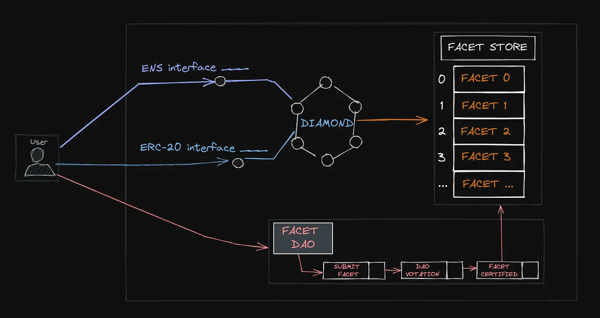

# Security Considerations

### Ownership and Authentication

Authentication schemes can be very simple or complex, fine grained or coarse. This proposal does not limit it in any way, examples -

- Ownership/authentication could be as simple as a single account address having the authority to add/replace/remove functions.
- Decentralized autonomous organization could have the authority to only add/replace/remove certain functions.
    
    
    
    - Consensus functionality could be implemented such as an approval function
        - multiple different people call to approve changes before they are executed with the `diamondCut` function.

*The development of standards and implementations of ownership, control and authentication of diamonds is encouraged.*

### Arbitrary Execution with `diamondCut`

The `diamondCut` function allows arbitrary execution with access to the diamond’s storage (through `delegatecall`). Access to this function must be restricted carefully.

### Do Not Self Destruct

Use of `selfdestruct` in a facet is heavily discouraged. Misuse of it can delete a diamond or a facet.

### Function Selector Clash

A function selector clash occurs when two different function signatures hash to the same four-byte hash, replacing an existing function in a diamond when the intention was to add a new function. 

- This scenario is not possible with a properly implemented `diamondCut` function because it prevents adding function selectors that already exist.

### Transparency

Diamonds emit an event every time one or more functions are added, replaced or removed. 

- All source code can be verified. This enables people and software to monitor changes to a contract.
- If any bad acting function is added to a diamond then it can be seen.

Security and domain experts can review the history of change of a diamond to detect any history of foul play.