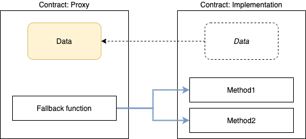
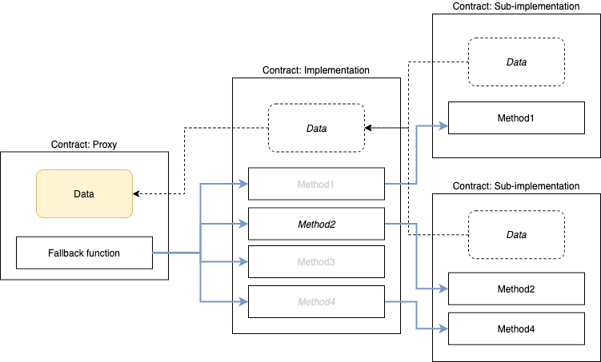

# **Proxies**
<aside>
**Diamond pattern** is similar to **multi-proxy pattern** which deploys **proxy and logic contracts.**
</aside>

## **Single Proxy Pattern**

- **Proxy contract is what the user interacts with and holds the data**
    - **Immutable but contains a [fallback function](https://docs.soliditylang.org/en/v0.8.9/contracts.html#fallback-function)**
        - **fallback function** catches any function call and uses `delegatecall`
         to forward it to the logic contract
        - `delegatecall` allows the proxy contract to use functions on the logic contract
    - **An external function is called on a diamond, the fallback function is executed**
        - Fallback function determines which facet to call based on first 4 bytes of call data (*function selector*), function is executed from the facet using `delegatecall`
        - Diamond’s fallback function and `delegatecall`enable a diamond to execute a facet’s function as if it was implemented by the diamond itself.
            - `msg.sender`and `msg.value`values do not change and only the diamond’s storage is read and written to.
    - **Logic contract stores functions, defined separate from data**
        - Logic contract address is defined in the proxy
            - Proxy can redefine logic contract addresses, allowing logic to be changed w/o impacting the underlying data
                - *managed via governance or controlled via a multi-sig wallet*
## Multi-Proxy Pattern

<aside>
Proxy pattern allows upgradability for smart contracts, the drawback is the entire logic contract must be replaced to add/replace/remove functions from proxy contract.
</aside>

## Multi-Facet Proxy (Diamond Pattern)

Multi-Facet Proxies provide granular control of functionality by allowing the Proxy to add/remove/replace functions without impacting other logic.
